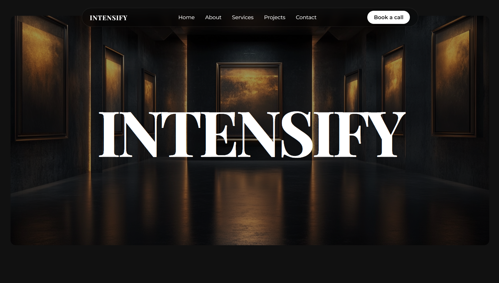

# 🏠Intensify - Premium Interior Design Platform

<div align="center">
  

  [](https://intensify-design.vercel.app)
  [](https://github.com/panduthegang/Intensify-Saas)
  [](LICENSE)

  **Transform Your Space Into an Extraordinary Experience** 🏠

  [Features](#-features) • [Demo](#-live-demo) • [Installation](#-installation) • [Tech Stack](#-tech-stack) • [Contributing](#-contributing)
</div>

---

## 🎯 About Intensify

**Intensify** is a modern, full-featured interior design platform that connects homeowners and businesses with world-class design professionals. Built with cutting-edge web technologies, it offers a seamless and elegant user experience from inspiration to implementation.

> 🌟 *"Creating timeless spaces that reflect your unique style and personality"*

### ✨ Why Choose Intensify?

- 🎨 **Beautiful UI/UX** - Crafted with meticulous attention to detail using premium design principles
- 🚀 **Lightning Fast** - Built on Vite for optimal performance and instant load times
- 📱 **Fully Responsive** - Perfect experience across all devices from mobile to desktop
- 🔒 **Secure & Reliable** - Enterprise-grade security for peace of mind
- 🌐 **Rich Portfolio** - Showcase of stunning interior design projects
- 💎 **Premium Experience** - Glassmorphism design with smooth animations

---

## 🎬 Live Demo

🔗 **[Visit Intensify Live](https://intensify-by-harsh.vercel.app)**

Experience the platform in action! Browse our portfolio, explore design services, and meet our expert team.

---

## 🎨 Features

### 🏡 Portfolio Showcase
- **Curated Design Projects** - Handpicked stunning interior designs across all categories
- **High-Quality Galleries** - Professional photography and immersive visuals
- **Interactive Project Cards** - Smooth animations and engaging interactions
- **Detailed Project Information** - Complete descriptions and client testimonials
- **Diverse Project Range** - Residential, Commercial, and Hospitality designs

### 🛎️ Services Offered
- 🏠 Residential Design
- 🏢 Commercial Interiors
- 🪴 Furniture Selection & Curation
- 🎨 Color Consultation
- 💡 Lighting Design
- 🛋️ Space Planning & Layout

### 👥 About & Team
- **Design Philosophy** - Learn our approach to creating beautiful spaces
- **Team Bios** - Meet the talented designers and creators
- **Experience & Credentials** - Industry expertise and accolades
- **Client Testimonials** - Real feedback from satisfied clients

### 💬 Client Engagement
- **Contact Form** - Easy communication with design consultants
- **Call Scheduling** - Book personalized design consultations
- **Social Media Integration** - Follow our latest projects and inspiration
- **Newsletter Signup** - Stay updated with design trends and new projects

### 🎯 User Experience
- **Glassmorphism Design** - Modern, premium aesthetic throughout
- **Smooth Animations** - Thoughtful transitions and micro-interactions
- **Mobile-First Design** - Optimized for touch and small screens
- **Floating Navigation** - Modern navbar with seamless interactions
- **Dark Theme** - Elegant dark interface that highlights content
- **Responsive Layout** - Adapts beautifully to any screen size

---

## 🛠️ Tech Stack

### Frontend
- **⚛️ React 18** - Modern UI library with hooks and latest features
- **📘 TypeScript** - Type-safe development for robust code
- **⚡ Vite** - Next-generation frontend tooling with lightning-fast builds
- **🎨 Tailwind CSS** - Utility-first CSS framework for rapid styling
- **🎭 Lucide React** - Beautiful, consistent icon library

### Routing & Navigation
- **🛣️ React Router v7** - Client-side routing for seamless navigation
- **📍 Dynamic Routes** - SEO-friendly URLs for optimal performance

### Development Tools
- **📦 npm** - Package management
- **🔍 ESLint** - Code quality and consistency
- **📝 PostCSS** - CSS transformations and optimizations
- **🔨 TypeScript ESLint** - TypeScript-specific linting

---

## 🚀 Installation

### Prerequisites

Before you begin, ensure you have the following installed:
- **Node.js** (v18 or higher) - [Download](https://nodejs.org/)
- **npm** (comes with Node.js) or **yarn**
- **Git** - [Download](https://git-scm.com/)

### Step 1: Clone the Repository

```bash
git clone https://github.com/panduthegang/Intensify-Saas.git
cd Intensify-Saas
```

### Step 2: Install Dependencies

```bash
npm install
```

or if you prefer yarn:

```bash
yarn install
```

### Step 3: Run Development Server

```bash
npm run dev
```

The application will open at `http://localhost:5173` 🎉

### Step 4: Build for Production

```bash
npm run build
```

### Step 5: Preview Production Build

```bash
npm run preview
```

---

## 📁 Project Structure

```
Intensify-Saas/
├── 📂 public/                 # Static assets
│   └── Hero.png              # Hero section image
├── 📂 src/
│   ├── 📂 components/        # React components
│   │   ├── About.tsx         # About section
│   │   ├── Blog.tsx          # Blog/Insights section
│   │   ├── Footer.tsx        # Footer component
│   │   ├── Gallery.tsx       # Project gallery
│   │   ├── Hero.tsx          # Hero section
│   │   ├── Navbar.tsx        # Navigation bar
│   │   ├── Services.tsx      # Services showcase
│   │   └── Testimonials.tsx  # Client reviews
│   ├── 📂 pages/             # Page components
│   │   ├── HomePage.tsx      # Home page
│   │   ├── AboutPage.tsx     # About page
│   │   └── PortfolioPage.tsx # Portfolio/Projects page
│   ├── App.tsx               # Main app component
│   ├── main.tsx              # Entry point
│   ├── index.css             # Global styles
│   └── vite-env.d.ts         # Vite environment types
├── 📄 .gitignore             # Git ignore rules
├── 📄 package.json           # Dependencies
├── 📄 tailwind.config.js     # Tailwind configuration
├── 📄 tsconfig.json          # TypeScript config
├── 📄 vite.config.ts         # Vite configuration
└── 📄 README.md              # You are here!
```

---

## 🎨 Design System

### Color Palette

Intensify uses a sophisticated, premium color scheme inspired by modern interior design:

| Element | Color | Usage |
|---------|-------|-------|
| ⚫ Background | `#000000` | Main background |
| ⚪ Text | `#FFFFFF` | Primary text |
| 🔆 Accents | `#CCCCCC` | Subtle accents, borders |
| 🎨 Highlights | `#E5E5E5` | Interactive elements |

### Typography

- **Primary Font**: System fonts optimized for readability
- **Font Sizes**: Carefully scaled for visual hierarchy
- **Line Heights**: 150% for body text, 120% for headings
- **Font Weights**: 3 weights maximum (400, 600, 700)

### Design Principles

- **Glassmorphism** - Semi-transparent, frosted glass effects
- **Dark Theme** - Premium, elegant dark aesthetic
- **Minimal Animations** - Smooth, purposeful transitions
- **White Space** - Generous spacing for clarity
- **High Contrast** - Readable text on all backgrounds

---

## 🌟 Key Pages

### 🏠 Home Page (`/`)
- Hero section with striking visuals
- Featured project gallery
- Services showcase with descriptions
- Client testimonials and reviews
- Contact section for inquiries
- Call-to-action buttons

### 📖 About Page (`/about`)
- Company mission and philosophy
- Team member profiles
- Experience and credentials
- Design approach and process
- Before/after project showcases
- Client success stories

### 🎨 Portfolio Page (`/portfolio`)
- Stunning hero section with background image
- Complete project showcase with detailed descriptions
- Alternating layout for visual interest
- Client testimonials for each project
- 6 diverse projects across Residential, Commercial, and Hospitality categories
- Hover effects on project images
- Mobile-responsive design

---

## 🎯 Available Scripts

| Command | Description |
|---------|-------------|
| `npm run dev` | Start development server on http://localhost:5173 |
| `npm run build` | Build for production |
| `npm run preview` | Preview production build locally |
| `npm run lint` | Run ESLint for code quality |
| `npm run typecheck` | Check TypeScript types |

---

## 🌐 Deployment

### Deploy to Vercel (Recommended)

1. Push your code to GitHub
2. Visit [vercel.com](https://vercel.com)
3. Import your repository
4. Vercel will auto-detect Vite configuration
5. Deploy! 🚀

[](https://vercel.com/new/clone?repository-url=https://github.com/panduthegang/Intensify-Saas)

### Deploy to Other Platforms

**Netlify:**
```bash
# Connect your GitHub repo to Netlify
# Build command: npm run build
# Publish directory: dist
```

**GitHub Pages:**
```bash
npm run build
# Deploy the dist folder to GitHub Pages
```

---

## 🤝 Contributing

Contributions are what make the open-source community amazing! Any contributions you make are **greatly appreciated**.

### How to Contribute

1. **Fork the Project**
   ```bash
   # Click the 'Fork' button at the top of this page
   ```

2. **Clone Your Fork**
   ```bash
   git clone https://github.com/your-username/Intensify-Saas.git
   cd Intensify-Saas
   ```

3. **Create a Feature Branch**
   ```bash
   git checkout -b feature/AmazingFeature
   ```

4. **Make Your Changes**
   - Write clean, readable code
   - Follow existing code style
   - Add meaningful comments where necessary
   - Test your changes thoroughly

5. **Commit Your Changes**
   ```bash
   git commit -m 'Add some AmazingFeature'
   ```

6. **Push to Your Branch**
   ```bash
   git push origin feature/AmazingFeature
   ```

7. **Open a Pull Request**
   - Go to the original repository
   - Click 'New Pull Request'
   - Describe your changes clearly
   - Link any related issues

### Contribution Guidelines

- 📝 Write clear, descriptive commit messages
- 🧪 Test your changes thoroughly before submitting
- 📚 Update documentation if adding new features
- 🎨 Follow the existing code style and conventions
- 🐛 Report bugs using GitHub Issues
- 💡 Suggest improvements and features

---

## 🐛 Bug Reports

Found a bug? Please help us improve Intensify!

1. **Check Existing Issues** - Someone might have already reported it
2. **Create a New Issue** - Include detailed steps to reproduce
3. **Add Screenshots** - Visual context helps tremendously
4. **Describe Expected Behavior** - What should happen?
5. **Include Environment Info** - OS, browser, Node version

---

## 💡 Feature Requests

Have an idea to make Intensify better?

1. Open an issue with the `enhancement` label
2. Describe your feature in detail
3. Explain why it would be valuable
4. Share any implementation ideas
5. Discuss potential use cases

---

## 📊 Project Stats

- **100% Responsive** design
- **Type-Safe** with TypeScript
- **Modern** component architecture
- **Smooth Animations** throughout
- **Fast Loading** with Vite
- **SEO Optimized** for better visibility

---

## 🎓 Learning Resources

Want to learn more about the technologies used?

- [React Documentation](https://react.dev)
- [TypeScript Handbook](https://www.typescriptlang.org/docs/)
- [Vite Guide](https://vitejs.dev/guide/)
- [Tailwind CSS Docs](https://tailwindcss.com/docs)
- [React Router Documentation](https://reactrouter.com/)

---

## 🙏 Acknowledgments

- **Design Inspiration** - Modern design studios and platforms
- **Icons** - [Lucide Icons](https://lucide.dev)
- **Images** - [Pexels](https://pexels.com) & [Unsplash](https://unsplash.com)
- **Fonts** - System fonts and modern typography
- **Framework** - [React](https://react.dev) and [Vite](https://vitejs.dev)

---

## 📄 License

This project is licensed under the **MIT License** - see the [LICENSE](LICENSE) file for details.

---

## 👨‍💻 Developer

**Built with ❤️ by [panduthegang](https://github.com/panduthegang)**

- 🐙 GitHub: [@panduthegang](https://github.com/panduthegang)
- 💼 Portfolio: [panduthegang](https://harshrathod-portfolio.vercel.app)

---

## 🌟 Show Your Support

If you found this project helpful, please consider:

- ⭐ Starring the repository
- 🍴 Forking for your own projects
- 📢 Sharing with fellow developers and designers
- 🐛 Reporting issues and helping debug
- 💡 Suggesting features and improvements

---

<div align="center">

  ### 🏠 Ready to Transform Your Space?

  **[Visit Intensify](https://intensify-design.vercel.app)** • **[Report Bug](https://github.com/panduthegang/Intensify-Saas/issues)** • **[Request Feature](https://github.com/panduthegang/Intensify-Saas/issues)**

  ---

  Made with 💙 and ☕ by designers and developers who love beautiful spaces

  **© 2025 Intensify. All rights reserved.**

</div>
